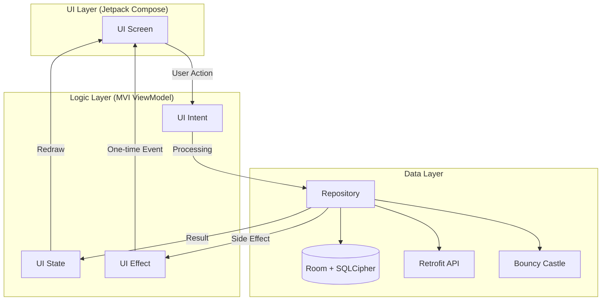
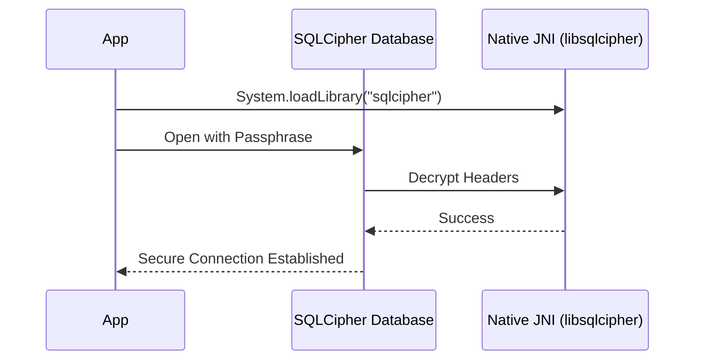

<h1 align="center">🚀 ApexVest: Enterprise-Grade Digital Finance</h1>

<p align="center">
  
  
  
  
</p>

<p align="center">
  <b>ApexVest</b> is a cutting-edge, personal educational project designed to push the boundaries of modern Android development. It integrates <b>AI Robo-Advisory</b>, <b>Web3 HD Wallets</b>, <b>ISO 20022 Compliance</b>, and <b>Advanced Fraud Analytics</b> into a single, cohesive ecosystem.
</p>

---

## 📊 MAD Score (Modern Android Development)

ApexVest is built following the strictest **MAD** guidelines provided by Google.

| Category | Component | Status |
| :--- | :--- | :--- |
| **Language** | Kotlin (Coroutines, Flows, Context Receivers) | ✅ 100% |
| **UI** | Jetpack Compose (Material 3, Neon Custom Theme) | ✅ 100% |
| **Architecture** | Unidirectional Data Flow (MVI) | ✅ 100% |
| **Dependency Injection** | Hilt (Dagger) | ✅ 100% |
| **Persistence** | Room + SQLCipher (Military-Grade Encryption) | ✅ 100% |
| **Network** | Retrofit + OkHttp + Serialization | ✅ 100% |

---

## 🌟 Key Enterprise Features

### 🧠 1. AI-Driven Robo-Advisory (MPT)
Real-time on-device simulation of **Modern Portfolio Theory**.
- **Portfolio Rebalancing**: Dynamic adjustment based on user risk profiles.
- **Risk Scoring**: Behavioral-based risk assessment updated via UI.

### 🌐 2. Web3 & Crypto Gateway
Native integration with decentralized protocols.
- **HD Wallet Derivation**: Securely generate Bitcoin/Ethereum compatible wallets (BIP-32/44).
- **Web3 Init**: Instant generation of unique blockchain addresses.
- **Staking Simulation**: Yield calculation for multi-chain assets.

### 🛡️ 3. Fraud Analytics & Behavioral Telemetry
Security layer monitoring user interactions.
- **Biometric Intent Binding**: Hardware-backed verification for critical actions.
- **Trust Scoring**: Real-time analysis of user touch dynamics and interaction velocity.
- **Memory Protection**: `FLAG_SECURE` integration to prevent memory dumping and screenshots.

### 💱 4. Multi-Currency Settlement (ISO 20022)
Enterprise messaging for international transfers.
- **Atomic Swaps**: Instant, cryptographic-safe currency exchange.
- **Consolidated Liquidity**: Real-time conversion of global balances to USD.
- **Compliance Engine**: Generating compliant XML/JSON payloads for SWIFT transactions.

---

## 🏗 Architecture & Flow

ApexVest utilizes a sophisticated **Unidirectional Data Flow (UDF)** model built on the **MVI (Model-View-Intent)** architecture.

### 🗺 System Architecture


### 🔐 Database Security Flow


---

## 📁 Project Structure

The project is strictly modularized to ensure separation of concerns and high scalability.

```text
├── app/                  # Main entry point, Hilt Application, Navigation
├── core/
│   ├── common/           # MVI Primitives, Base Classes, Security Manager
│   ├── crypto/           # Bouncy Castle, BIP-32 Derivation
│   ├── database/         # Room Database, SQLCipher Configuration
│   ├── designsystem/     # Neon Theme, Custom Components, Colors
│   ├── navigation/       # Type-safe navigation logic
│   ├── network/          # Retrofit, ISO 20022 Compliance Engine
│   └── ai/               # ML Kit & Math Logic
└── feature/
    ├── dashboard/        # Nexus: Market overview & quick actions
    ├── market/           # Real-time tickers & Stake controls
    ├── wallet/           # Vault: Consolidated liquidity & Web3
    ├── fraud/            # Telemetry collection & Trust scoring
    └── onboarding/       # AI-driven user verification
```

---

## 🎨 Visual Showcase


<p align="center">
  
  
  
</p>
<p align="center">
  
  
  
</p>

---

## 🛠 Tech Stack

- **UI**: [Jetpack Compose](https://developer.android.com/jetpack/compose)
- **Asynchronous**: [Kotlin Coroutines](https://kotlinlang.org/docs/coroutines-overview.html) & [Flow](https://kotlinlang.org/docs/flow.html)
- **Dependency Injection**: [Hilt](https://dagger.dev/hilt/)
- **Database**: [Room](https://developer.android.com/training/data-storage/room) with [SQLCipher](https://www.zetetic.net/sqlcipher/)
- **Networking**: [Retrofit](https://square.github.io/retrofit/) & [OkHttp](https://square.github.io/okhttp/)
- **Security**: [Bouncy Castle](https://www.bouncycastle.org/) (Crypto), [Biometric API](https://developer.android.com/training/sign-in/biometric-auth)
- **Testing**: [Mockito](https://site.mockito.org/), [JUnit4](https://junit.org/junit4/)

---

## 🚀 Getting Started

1. Clone the repository.
2. Open in **Android Studio Meerkat** or newer.
3. Sync Gradle and ensure you have **Java 17** configured.
4. Run `:app` on an emulator or physical device (Min SDK 26).

---

